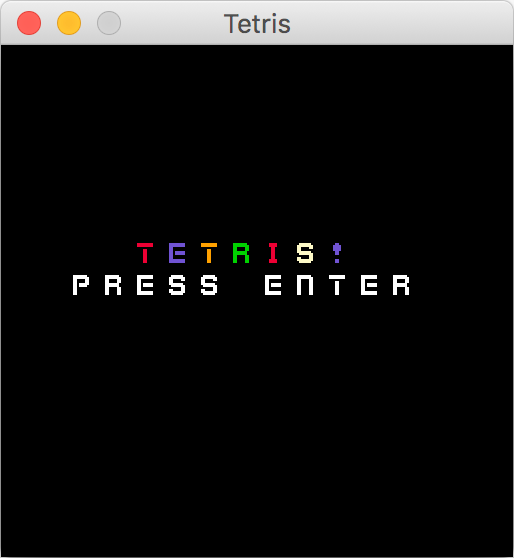
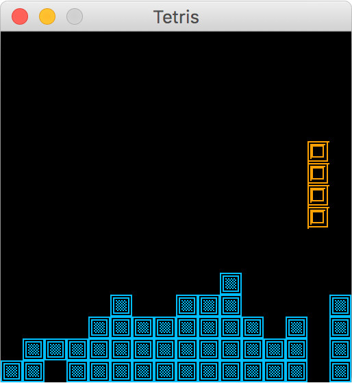

# tetris-clj

Tetris in Clojure! 🕹️

## Getting Started

1. Clone the project
2. Run the project via Leiningen using `lein run`.

### Prerequisites

You need to have [Leiningen](https://leiningen.org/) installed on your machine.

## Controls
* _a_ - Moves current piece left.
* _d_ - Moves current piece right.
* _s_ - Moves current piece down.
* _e_ - Rotates current piece.

## Images

## Built With

* [Quil](http://quil.info/) - Drawing framework
* [Kenny.nl 1-Bit Pack](https://www.kenney.nl/assets/bit-pack) - Sprites

## Authors

* **Salvatore Tosti** - *Initial work* - [SalvatoreTosti](https://github.com/SalvatoreTosti)

## License

This project is licensed under the Eclipse Public License 1.0 - see the [LICENSE.md](LICENSE.md) file for details
